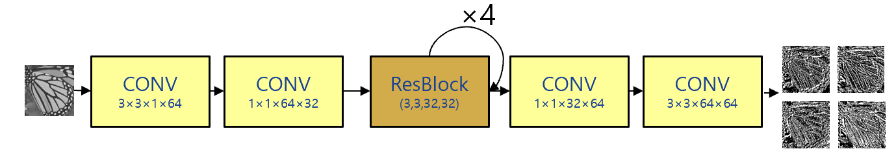

# Super-Resolution Baselines

- All baseline source code can be found [here](./model/baselines/)
- To adjust the configuration of baselines, please refer to [template](./template/train_baseline.py)
- For training script, refer to [scripts](./scripts/)

## Updates

### 16-12-2023
- Training SMSR, with 2 different implementation for training (gumbel-softmax) and validation (argmax)
- Re-train RCAN with a smaller number of parameters

    | Net   | PSNR   | Density | FLOPs |
    |-------|--------|---------|-------|
    | EDSR  | 32.34  |         |       |
    | RCAN  | 33.283 |         |       |
    | DGNet | 33.08  |         |       |
    | SMSR  | 32.703 | 0.750   |       |
    |       |        |         |       |
    |       |        |         |       |

### 09-12-2023
- Finish SMSR, and test pipeline of DGNet, SMSR
- The training pipeline of SMSR has some problem since the original implementation does not considered the case that channel mask will be all spares or dense -> Fix this later
- Training results:

    | **Network** | **PSNR** | **FLOPs** |
    |-------------|----------|-----------|
    | EDSR        | 32.34    |           |
    | RCAN        | 33.34    |           |
    | DGNet       | 33.08    |           |
    | SMSR        |          |           |

- Next plan:
    - Fix pipeline of SMSR, use customed version of SMSR
    - Adjust the number of RCAN's parameters to be balance with others
    - Calculate FLOPs function
    
### 02-12-2023
- Finish EDSR, RCAN, DGNet - based network.
- Train EDSR, RCAN succesfully, not test with DGNet yet.
- Not implement SMSR-like network yet
- All networks follow a similar archintecture: Hourglass architecture with diffent body blocks (Residual + Attention)
 
- Training results:

    | **Network** | **PSNR** | **FLOPs** |
    |-------------|----------|-----------|
    | EDSR        | 32.34    |           |
    | RCAN        | 33.34    |           |
    | DGNet       |          |           |
    | SMSR        |          |           |

- Comments: 
    - Significant gap between EDSR and RCAN might be the difference in number of parameters. The current baseline setup lets RCAN parameters higher than EDSR.
